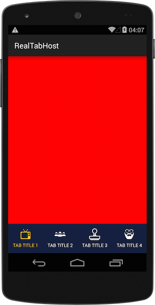

RealTabHost
====

Ever been frustrated by the way TabHost work on Android ? No customization, really basic. RealTabHost is made to provide the behavior of TabHost the way it should have been from the beginning !

With TabHost, you can easily achieve this result :



- Use a custom layout for the tab, no `android:id` is needed, the lib will get the first `TextView` and first `ImageView` to set the element
- Navigate through fragments, by providing a fragment per tab
- Customize tab bar height
- Configure normal text and icon color
- Configure selected text and icon color
- Syntax similar to TabHost

## Usage

Custom tab XML :

```xml
<LinearLayout xmlns:android="http://schemas.android.com/apk/res/android"
              android:layout_width="match_parent"
              android:layout_height="match_parent"
              android:gravity="center"
              android:orientation="vertical">

    <ImageView
            android:layout_width="30dp"
            android:layout_height="30dp" />

    <TextView
            android:layout_width="wrap_content"
            android:layout_height="wrap_content"
            android:layout_marginTop="5dp"
            android:gravity="center"
            android:textSize="12sp" />
</LinearLayout>
```

Java :

```java
public class MainActivity extends AppCompatActivity {

    @Override
    protected void onCreate(Bundle savedInstanceState) {
        super.onCreate(savedInstanceState);

        setContentView(R.layout.activity_main);

        FragmentTabHost tabHost = (FragmentTabHost) findViewById(R.id.tabhost);
        tabHost.setup(this, getSupportFragmentManager());

        tabHost.addTab(tabHost.newTabSpec("TAB TITLE 1", R.drawable.campaign_logo, R.layout.custom_tab, MainFragment.newInstance(Color.RED)));
        tabHost.addTab(tabHost.newTabSpec("TAB TITLE 2", R.drawable.agency_logo, R.layout.custom_tab, MainFragment.newInstance(Color.GREEN)));
        tabHost.addTab(tabHost.newTabSpec("TAB TITLE 3", R.drawable.advertiser_logo, R.layout.custom_tab, MainFragment.newInstance(Color.BLUE)));
        tabHost.addTab(tabHost.newTabSpec("TAB TITLE 4", R.drawable.creative_logo, R.layout.custom_tab, MainFragment.newInstance(Color.GRAY)));

        // Customization
        tabHost.setHeight(230);
        tabHost.setBackgroundColor(getResources().getColor(R.color.darkblue));
        tabHost.setNormalTintColor(getResources().getColor(R.color.white));
        tabHost.setSelectedTintColor(getResources().getColor(R.color.yellow));

        tabHost.build();
    }
}
```